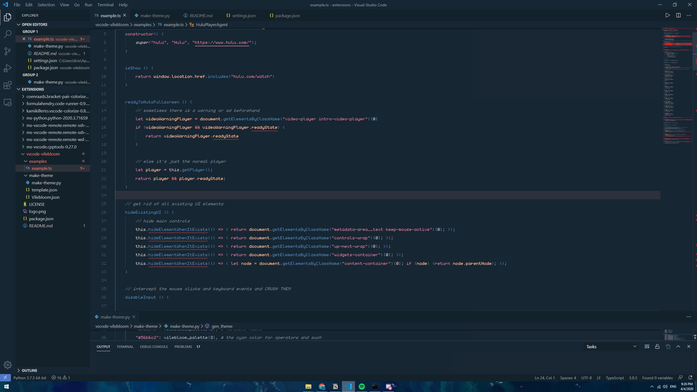

# vilebloom for Visual Studio Code

This theme has been developed while using it with TypeScript and JavaScript. I am not sure how it'd be like with other languages.

## Screenshot


Please note that screenshot is taken while using these settings:

```
    "workbench.colorTheme": "Vilebloom",
    "bracket-pair-colorizer-2.colors": [
        "#5483AA",
    ],
    "editor.letterSpacing": 0.5,
    "editor.fontFamily": "PixelMPlus10",
    "editor.fontSize": 14,
    "editor.lineHeight": 26,
```

Link to the font: https://datagoblin.itch.io/monogram
Note that there is no support for unicode characters :(

If you want a font with support for Japanese, Russian, and Greek characters, use PixelMPlus10:
Link to the font: http://itouhiro.hatenablog.com/entry/20130602/font
(bonus: it has support for Japanese characters! ...but they're not monospace)

## Features

That's the list of things I wanted to focus on while developing vilebloom:

- Strings and numbers must be strongly pointed out
- Comments must pop out
- During a search, the highlighted matches must be _really_ highlighted 
- Colors should use a known palette (Material UI)

## Installation

### Cloning the Repository

Change to your Visual Studio Code extensions directory:

```bash
# Windows
$ cd %USERPROFILE%\.vscode\extensions

# Linux & macOS
$ cd ~/.vscode/extensions/
```

Clone repository as `vilebloom`:

```bash
$ git clone https://github.com/brethower-k/vscode-vilebloom brethower-k.vilebloom
```

Now you can select this theme from the Theme selector in VSC

## License

This work is licensed under the MIT license
